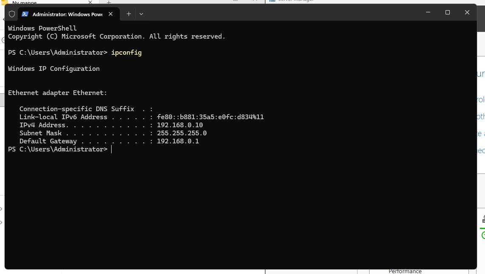
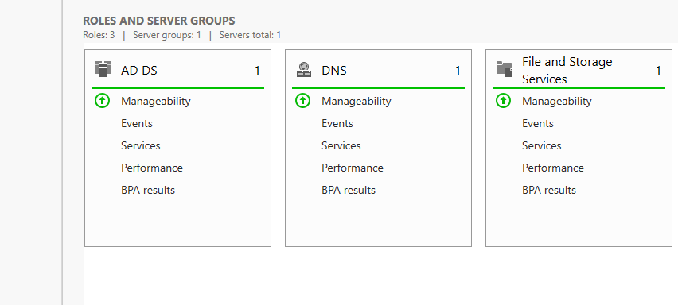
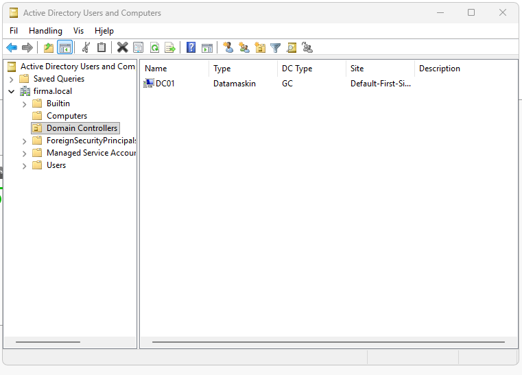
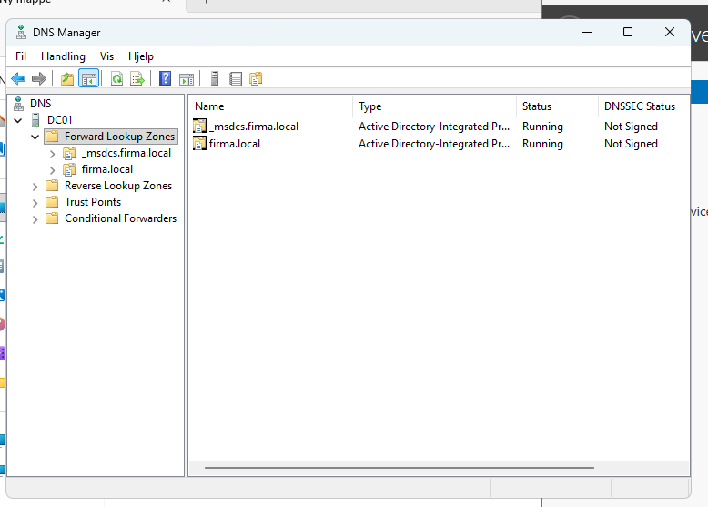
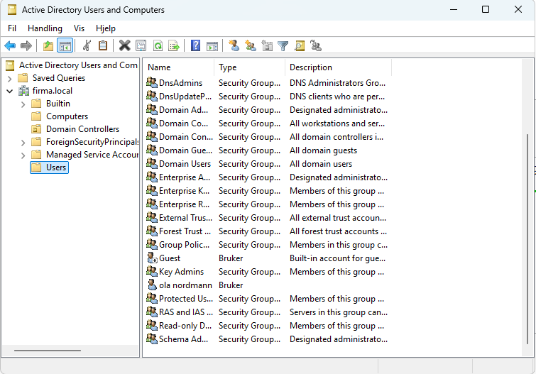
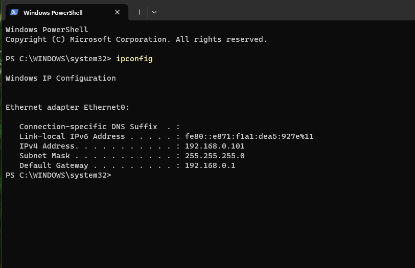
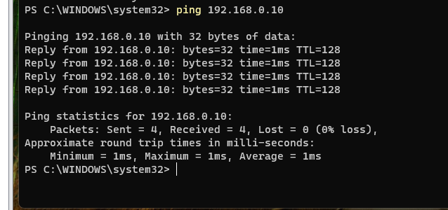
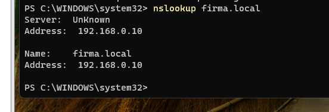
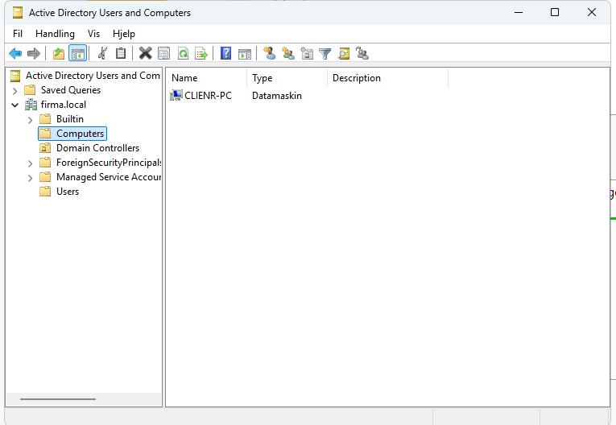

# Windows Server 2025 – Active Directory Lab

Et praktisk Windows Server 2025-prosjekt med **Active Directory Domain Services (AD DS)**, **DNS** og en **Windows 11 Pro-klient**.

Målet med prosjektet var å lære hvordan en Windows Server kan brukes som **Domain Controller**, hvordan brukere og datamaskiner administreres sentralt, og hvordan en klientmaskin kobles til og bruker et Active Directory-domene.

---

## Prosjektoversikt

I labmiljøet ble følgende satt opp og testet:

- Windows Server 2025
- Active Directory Domain Services
- Domain Controller
- DNS
- Domenet `firma.local`
- Domenebruker
- Windows 11 Pro-klient
- Nettverkskommunikasjon mellom klient og server
- DNS-oppslag
- Domain Join
- Pålogging med domenebruker
- Registrering av klientmaskinen i Active Directory

---

## Miljø

### Server

| Komponent | Konfigurasjon |
|---|---|
| Operativsystem | Windows Server 2025 |
| Servernavn | DC01 |
| Domene | `firma.local` |
| IPv4-adresse | `192.168.0.10` |
| Subnet mask | `255.255.255.0` |
| Default gateway | `192.168.0.1` |
| DNS-server | `192.168.0.10` |

### Klient

| Komponent | Konfigurasjon |
|---|---|
| Operativsystem | Windows 11 Pro |
| Maskinnavn | CLIENT-PC |
| Plattform | VMware Workstation |
| IPv4 | DHCP |
| DNS-server | `192.168.0.10` |
| Domene | `firma.local` |

---

## Nettverksstruktur

```text
Router
192.168.0.1
    |
    +---- DC01
    |     192.168.0.10
    |     Active Directory
    |     DNS
    |
    +---- CLIENT-PC
          192.168.0.x
          Windows 11 Pro
```

---

## Designvalg og begrunnelse

### Statisk IP på DC01

DC01 fikk en fast IPv4-adresse:

```text
192.168.0.10
```

En Domain Controller bør være tilgjengelig på en stabil adresse fordi klientmaskiner og domenetjenester må kunne finne serveren på samme IP-adresse over tid.

### DC01 som DNS-server

CLIENT-PC ble konfigurert til å bruke:

```text
192.168.0.10
```

som DNS-server.

Dette er viktig i et Active Directory-miljø fordi klienten må kunne finne domenet og Domain Controller ved hjelp av DNS.

### Windows 11 Pro som klient

Windows 11 Pro ble brukt fordi denne utgaven støtter tilkobling til et Active Directory-domene.

### Bridged nettverk i VMware

Nettverksadapteren på CLIENT-PC ble konfigurert som:

```text
Bridged
```

Dette gjorde at CLIENT-PC kunne kommunisere på samme lokale nettverk som DC01.

---

# Gjennomføring

## 1. Installasjon og grunnoppsett av server

Windows Server 2025 ble installert på servermaskinen.

Serveren fikk navnet:

```text
DC01
```

Deretter ble nettverket konfigurert med:

```text
IP-adresse:      192.168.0.10
Subnet mask:     255.255.255.0
Default gateway: 192.168.0.1
DNS-server:      192.168.0.10
```



---

## 2. Active Directory Domain Services

Rollen **Active Directory Domain Services (AD DS)** ble installert gjennom:

```text
Server Manager → Manage → Add Roles and Features
```

Etter installasjonen ble serveren promotert til **Domain Controller**.

Domenet som ble opprettet var:

```text
firma.local
```

Active Directory brukes til sentral administrasjon av blant annet brukere, datamaskiner, grupper og rettigheter.





---

## 3. DNS

DNS ble konfigurert på DC01.

DC01 bruker:

```text
192.168.0.10
```

som DNS-adresse.

DNS er viktig i Active Directory fordi klientmaskiner må kunne finne domenet og Domain Controller ved hjelp av navn.



---

## 4. Opprettelse av domenebruker

Følgende verktøy ble brukt:

```text
Server Manager → Tools → Active Directory Users and Computers
```

Det ble opprettet en domenebruker:

```text
ola.nordmann
```

Brukeren ble senere brukt for å teste pålogging på klientmaskinen.



---

## 5. Oppsett av CLIENT-PC

Det ble opprettet en virtuell klientmaskin i VMware Workstation.

Maskinen fikk navnet:

```text
CLIENT-PC
```

Windows 11 Pro ble installert som klientoperativsystem.

Nettverksadapteren ble konfigurert som:

```text
Bridged
```

Dette gjorde at klienten kunne kommunisere med DC01 på samme lokale nettverk.

---

## 6. Kontroll av klientens IP-adresse

På CLIENT-PC ble følgende kommando brukt:

```powershell
ipconfig
```

Klienten fikk:

```text
IPv4-adresse:    192.168.0.101
Subnet mask:     255.255.255.0
Default gateway: 192.168.0.1
```

DC01 hadde adressen:

```text
192.168.0.10
```

Dette viste at serveren og klienten var på samme lokale nettverk.



---

## 7. Test av kommunikasjon

Fra CLIENT-PC ble forbindelsen til DC01 testet med:

```powershell
ping 192.168.0.10
```

Testen var vellykket.

Resultatet viste:

```text
Sent = 4, Received = 4, Lost = 0
```

Dette bekreftet at CLIENT-PC kunne kommunisere med DC01 over nettverket.



---

## 8. DNS-konfigurasjon på CLIENT-PC

CLIENT-PC fikk IPv4-adressen automatisk via DHCP.

DNS-serveren ble konfigurert til:

```text
192.168.0.10
```

Dette betyr at klienten bruker DNS-tjenesten på DC01 for å finne domenet og Active Directory-tjenester.

---

## 9. Test av DNS

DNS ble testet fra CLIENT-PC med:

```powershell
nslookup firma.local
```

Resultatet viste:

```text
firma.local → 192.168.0.10
```

Dette bekreftet at CLIENT-PC kunne finne domenet ved hjelp av DNS på DC01.

Forskjellen mellom de to testene var:

```powershell
ping 192.168.0.10
```

tester om klienten kan nå serverens IP-adresse.

```powershell
nslookup firma.local
```

tester om DNS kan oversette domenenavnet til riktig IP-adresse.



---

## 10. Domain Join

Etter at nettverk og DNS var kontrollert, ble CLIENT-PC koblet til:

```text
firma.local
```

Windows ba om legitimasjon til en konto med tillatelse til å legge datamaskinen inn i domenet.

Domain Join var vellykket, og klientmaskinen ble deretter startet på nytt.

---

## 11. Pålogging med domenebruker

Etter omstart ble:

```text
Annen bruker
```

valgt på innloggingsskjermen.

CLIENT-PC viste domenet:

```text
FIRMA
```

Det ble logget inn med:

```text
FIRMA\ola.nordmann
```

Påloggingen var vellykket.

Dette bekreftet at CLIENT-PC kunne kommunisere med Domain Controller og bruke en konto fra Active Directory.

---

## 12. Kontroll i Active Directory

Til slutt ble følgende åpnet på DC01:

```text
Server Manager → Tools → Active Directory Users and Computers
```

Under:

```text
firma.local → Computers
```

var:

```text
CLIENT-PC
```

registrert.

Dette bekreftet at klientmaskinen var medlem av domenet og registrert som et datamaskinobjekt i Active Directory.



---

# Validering

Prosjektet ble kontrollert fra både server- og klientsiden.

| Test | Resultat |
|---|---|
| DC01 har statisk IP | Bestått |
| AD DS installert | Bestått |
| Domain Controller opprettet | Bestått |
| Domenet `firma.local` opprettet | Bestått |
| Domenebruker opprettet | Bestått |
| CLIENT-PC og DC01 kommuniserer | Bestått |
| DNS-oppslag mot `firma.local` | Bestått |
| CLIENT-PC meldt inn i domenet | Bestått |
| Domenebruker kan logge inn | Bestått |
| CLIENT-PC registrert i Active Directory | Bestått |

---

# Resultat

Prosjektet resulterte i et fungerende Windows Server 2025-miljø med Active Directory og DNS.

Følgende ble gjennomført:

- Windows Server 2025 ble installert.
- Serveren fikk navnet `DC01`.
- DC01 fikk statisk IP-adresse `192.168.0.10`.
- Active Directory Domain Services ble installert.
- DC01 ble Domain Controller.
- Domenet `firma.local` ble opprettet.
- DNS ble konfigurert.
- En domenebruker ble opprettet.
- Windows 11 Pro ble installert på CLIENT-PC.
- CLIENT-PC kunne kommunisere med DC01.
- CLIENT-PC brukte DC01 som DNS-server.
- DNS-oppslag mot `firma.local` fungerte.
- CLIENT-PC ble medlem av domenet.
- Domenebrukeren kunne logge inn på CLIENT-PC.
- CLIENT-PC ble registrert i Active Directory.

---

# Hva jeg lærte

Gjennom prosjektet lærte jeg hvordan flere deler av et Windows Server-miljø arbeider sammen.

### IP-adresse

En IP-adresse identifiserer en enhet på nettverket.

I prosjektet:

```text
DC01      = 192.168.0.10
CLIENT-PC = 192.168.0.101
Router    = 192.168.0.1
```

### Statisk IP

DC01 fikk en statisk IP-adresse fordi adressen til serveren ikke bør endres.

### DHCP

CLIENT-PC fikk IPv4-adressen automatisk via DHCP.

I dette prosjektet ble DHCP brukt på klienten for automatisk adressekonfigurasjon, mens hovedfokuset var AD DS, DNS og Domain Join.

### Default Gateway

Default Gateway er veien fra det lokale nettverket til andre nettverk.

I prosjektet var routeren:

```text
192.168.0.1
```

### DNS

DNS brukes til å finne maskiner og tjenester ved hjelp av navn.

CLIENT-PC brukte:

```text
192.168.0.10
```

som DNS-server.

### Active Directory

Active Directory brukes til sentral administrasjon av blant annet brukere, datamaskiner, grupper og rettigheter.

### Domain

Et domene samler brukere og datamaskiner i et sentralt administrert miljø.

Domenet i prosjektet var:

```text
firma.local
```

### Domain Controller

En Domain Controller administrerer domenet og håndterer autentisering og domenetjenester.

I prosjektet var:

```text
DC01
```

Domain Controller.

### Lokal bruker og domenebruker

En lokal bruker finnes bare på den lokale datamaskinen.

Eksempel:

```text
LocalAdmin
```

En domenebruker administreres i Active Directory.

Eksempel:

```text
FIRMA\ola.nordmann
```

### Workgroup og Domain

En maskin i en Workgroup administreres hovedsakelig lokalt.

En maskin som er medlem av et Domain kan administreres sentralt gjennom Active Directory.

---

# Viktige kommandoer

Kontroll av nettverksinformasjon:

```powershell
ipconfig
```

Test av forbindelse mellom CLIENT-PC og DC01:

```powershell
ping 192.168.0.10
```

Test av DNS:

```powershell
nslookup firma.local
```

---

# Labmiljø sammenlignet med produksjon

Dette prosjektet er et mindre opplæringsmiljø.

I et større produksjonsmiljø ville man normalt vurdert blant annet:

- flere Domain Controllers for redundans
- backup og restore-rutiner
- Group Policy for sentral konfigurasjon
- strengere administrative rettigheter
- overvåking og logging
- patching og vedlikehold
- nettverkssegmentering
- dokumenterte sikkerhetsrutiner

Labmiljøet fokuserer på grunnleggende Active Directory-, DNS- og Domain Join-funksjonalitet.

---

# Kompetanse demonstrert

Prosjektet viser praktisk erfaring med:

- Windows Server 2025
- Active Directory Domain Services
- Domain Controller
- Active Directory Users and Computers
- DNS
- Statisk IPv4-konfigurasjon
- Windows 11 Pro
- VMware Workstation
- Domain Join
- Domenebrukere
- Nettverkstesting med `ping`
- DNS-testing med `nslookup`
- Klient- og servervalidering
- Teknisk dokumentasjon

---

# Repository-struktur

```text
windows-server-2025-ad-lab/
|
|-- README.md
|
`-- screenshots/
    |-- 01-server-manager-roles.png
    |-- 02-active-directory-domain-controller.png
    |-- 03-active-directory-user-ola.png
    |-- 04-client-pc-domain-member.png
    |-- 05-dns-manager-firma-local.png
    |-- 06-server-ipconfig.png
    |-- 07-client-ipconfig.png
    |-- 08-client-ping-dc01.png
    `-- 09-client-nslookup-firma-local.png
```

Skjermbildene lagres i `screenshots/` og vises direkte under de relevante stegene i denne README-filen.

---

# Sikkerhet

Ingen passord eller andre sensitive autentiseringsopplysninger er inkludert i repositoryet.

IP-adressene og domenenavnet som vises her tilhører labmiljøet.

---

# Prosjektstatus

**Fullført**

Prosjektet demonstrerer et grunnleggende Windows Server 2025-domene fra serveroppsett og Active Directory til DNS-testing, Domain Join og pålogging med domenebruker.
